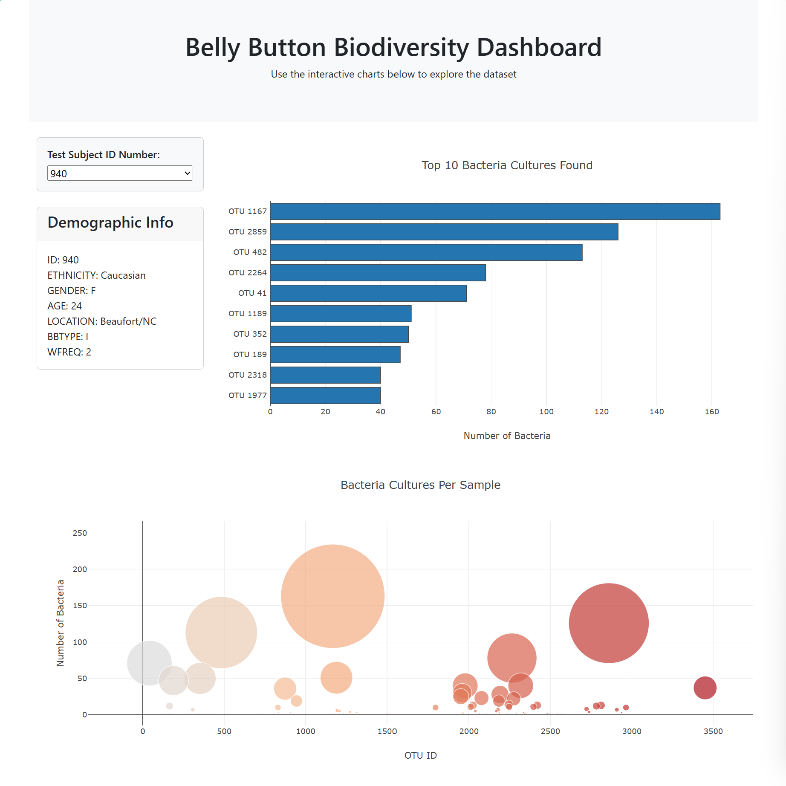

# Module 14: belly-button-challenge

### Overview

For this assignment, I was asked to build an interactive dashboard to explore the [Belly Button Biodiversity dataset](http://robdunnlab.com/projects/belly-button-biodiversity/), which catalogs the microbes that colonize human navels.

### Repo Contents

1. Images folder - contains a sample image of the dashboard
2. static\js folder - contains the app.js javascript code 
3. index.html - html for the Belly Button Biodiversity Dashboard web page

### Belly Button Biodiversity Dashboard

The D3 library is used to read in `samples.json` from the URL `https://static.bc-edx.com/data/dl-1-2/m14/lms/starter/samples.json`.

A dashboard is created, containing the following elements:

1. A dropdown containing all of the Test Subject ID Numbers (sample IDs) in the samples.json file.

2. A chart of the metadata for the selected Test Subject, including:
- ID
- Ethnicity
- Gender
- Age
- Location
- Bbtype
- Wfreq

3. A horizontal bar chart that displays the top 10 OTUs found for the selected Test Subject. Hovering over each bar will provide the bacteria types comprising the sample as well as the sample value. 

4. A bubble chart that displays each sample for the selected Test Subject in more detail, indicating relative size.

5. Below is an example of the Belly Button Biodiversity Dashboard:

